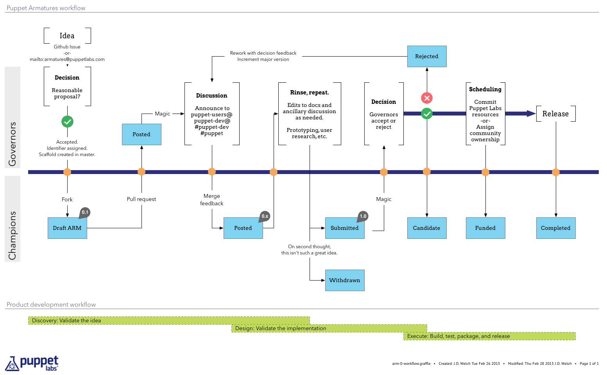

(ARM 0) Puppet Armatures 
========================

Introduction
------------

Open source projects often adopt an enhancement proposal process to
encourage design and discussion before complicated development work begins,
and it's in this spirit that Puppet Armatures came about. This process 
is heavily inspired by the Java community's [JEP][JEP1] process, but 
has changed over time to reflect the less formal nature of our 
community.

In some cases, ARMs are artifacts of the process leading up to one or several
issues/feature requests in the issue tracker. In others, they may be detailed,
principled specifications for major innovations.

Overview
--------

Puppet Armatures is a process for collecting, reviewing,
refining, and recording the result of proposals for enhancements to
Puppet and related ecosystem and processes.

An enhancement is an effort to design and implement a non trivial
change, or other types of work worth communicating broadly. An
enhancement; hereafter an "ARM" should be drafted for any work that meets
one of the following criteria:

1.  It requires more than 2 weeks of engineering
    construction effort, or
2.  It makes a significant change to something in the Puppet ecosystem, or to 
    the processes and infrastructure by which it is
    developed, or
3.  It is in high demand by developers or users

In addition, language changes are always considered significant, and 
since the implications for changes to the Puppet Langauge are more 
far-reaching, there is a slightly modified process for them which the 
"Process" section below calls out specifically.

The primary goal of the process is to enable _iterative_, productive 
conversations about proposals that influence the future direction of 
Puppet Projects.

The process is public; anyone may submit proposals as well as contribute
to any of the proposals.

The occurrence of a ARM only means that it is a proposal of record from
a technical perspective. There is no guarantee that anyone will work on
it, much less that its end result will appear in any release of any
project.

It is up to the project leadership to ascertain whether sufficient
collaborators have signed up to complete the work of a ARM to consider
it to be funded. Non funded, stale or otherwise defunct ARMs are taken
off the list.

Creating an ARM
---------------

This github repo contains an index of the ARMs and links to WIP 
documents. To get started, create a copy of the ARM template in a 
public Google document, with the "Sharing" options set to "Anyone can 
comment". Edit the boilerplate text with as much detail as possible, 
with at least the sections marked "required" filled in. Then,
open a github issue in the ARM repository requesting a new number, 
describe your proposed change, and link to the Google Doc.

The ARM consists of a Git repository where each top level folder is a
ARM identified by an ARM number and the name of the ARM.
One folder exists for defunct/old ARMs, and one for accepted/implemented
and archived ARMs. Defunct ARMs are garbage collected after 12 months of
their deprecation. Archived ARMs are kept (but are not updated to keep
in sync with the implementation).

We suggest that people working on a larger ARM fork the repository and use the 
fork (and its issue tracker) as the collaboration point to drive that ARM to
the point where it's ready for submission to the upstream repository.

The issue tracker for the master ARM project is used only for the
lifecycle of ARMs, not for handling issues/work related to the content
of the ARMs.

ARM Process
-----------

The ARM process encourages rapid iteration, feedback, and 
collaboration among stakeholders. It also incorporates a two-week 
timer to prevent stale ARMs, though in-depth discussion pauses the 
timer while it's on-going; discussions should run their course but not 
get side-tracked indefinitely. We want ARMs to incorporate feedback 
and either move through to "Completed" or be "Withdrawn" fairly 
quickly.  A successful ARM passes through the following states:

* **Draft** —  In circulation by the idea's advocate for initial review and
  consensus- building; Generally a fork of the ARM repository that has not
  been merged into the master branch. Language-specific changes should 
  go to the 
  [language-team@puppetlabs.com](mailto:language-team@puppetlabs.com) 
  mailing list for a quick vetting; two "+1"s and no "definitely not" 
  replies mean it can proceed to the next stage.

* **Posted** — Pushed into the ARM repository by the advocate for wider
  review. When an ARM is posted (via a pull request), comments must be
  requested from the [Puppet 
  Developers](https://groups.google.com/group/puppet-dev) mailing 
  list. Feedback from that forum, and any other means the
  advocate wishes, is incorporated by the advocate and other contributors
  until the ARM is ready for a more formal review. This posting starts 
  a two-week timer to avoid lingering, unreviewed ARMs. After seven 
  days, the advocate should post a "refresher" email to solicit any 
  further comments. Feedback which results in a major rework of the 
  proposal should cause a restart of the two-week timer (so the 
  advocate does not feel crunched to go back to the drawing board with 
  1 day remaining, for example). If no substantive objections arise 
    during the two week period, the ARM can move to the "Submitted" 
    phase.

* **Submitted** — Declared by the advocate as ready for evaluation by the
  Armatures governors. A formal review results in an up-or-down decision. If
  the proposal is accepted, it moves to Candidate status, and is given the
  major version 1.0. Submissions must be made by sending mail to the
  [Puppet Developers](https://groups.google.com/group/puppet-dev) 
  mailing list. Language changes require a summary of any differences 
  between the original and the Submitted proposal to the language-team 
  list, and again two +1s are necessary to green-light the proposal 
  for implementation.

* **Candidate** — Accepted for inclusion in iteration planning (costing and
  scheduling). A
  [ticket](https://tickets.puppetlabs.com/browse/PUP) is
  created for the purpose of tracking development.

* **Funded** — Implementation is costed and staffed. In some cases, Puppet
  Labs will be responsible for executing on an ARM; in others, community
  contributors (likely the ARM advocates) are responsible for execution,
  following the normal procedures for [contributing to Puppet]
  (https://github.com/puppetlabs/puppet/blob/master/CONTRIBUTING.md).

* **Completed** — Built, tested, packaged, released. Once completed, 
  the advocate moves the ARMs from the Google doc to a Markdown-format 
  file in this repository (we found the G-docs to be excellent for 
  commentary and collaboration but terrible for discoverability)

* **Rejected:** — The governors hope it doesn't happen, but there may come a
  point they must reject proposals outright. The proposal will still be in the
  repository, and advocates will be notified exactly why a proposal is
  rejected. Rejected proposals may be resubmitted after necessary rework. Re-
  submissions must increment the major version number.

* **Withdrawn:** — If the ARM advocate does not wish to continue further work,
  it can be marked as withdrawn. The proposal will contiune to exist, and 
  work may be taken up by a new advocate.

Text Format
-----------

Proposals are written using Github Flavored Markdown.

Encoding is always UTF-8.

Auxiliary Files
---------------

The major part of an ARM's content should be plain text, but they may include
auxiliary files such as diagrams. Such files should be named
`arm-[number]-[file_description].[extension]`.

Metadata
--------

A proposal always has one root file `metadata.json` that describes:

1.  **arm** - (required) self reference, the ARM number
2.  **title** - (required) Human-readable title for the ARM
3.  **advocate** - (required) Github handle of the primary author
4.  **organization** - a list of Github handles for contributors
    to the ARM, or a Github organization name
5.  **effort** - quantity of work required to fully implement. Resonable
    values: XS, S, M, L, XL, XXL
6.  **revision** - (required) a sequence number indicating the revision/version of the
    proposal. Revision uses semver (Major, Minor, Micro, where micro
    changes means that only typos or formatting have changed). The first
    version made available for consideration to be implemented should be
    1.0. Change in the Major number indicates a new completed version to
    be considered for implementation. Changes of the Minor number are
    work in progress revisions up to the next release, mostly of concern
    to those collaborating on the ARM
7.  **requires** - a list of ARMs that must be implemented before
    this ARM can be implemented
8.  **project** - (required) a URL or list of URLs to the project's homepage (typically
    a github repository complete with issue tracker); i.e. as simple/complex
    as required by the size/complexity of the ARM. Further information about
    the project/work should be found there, like URLs to puppet project
    branches where exploratory/reference implementions, issue tracking,
    meetings, schedule, who's who, etc. as dictated by the complexity/size of
    the project
9.  **issues** - when the ARM is in the late stages, there will be
    one or several Puppet Labs tickets tracking implementation work; URLs to
    these are also included in this file
10. **implementation** - when the ARM is in the late stages, there
    will be one or several Puppet Labs tickets tracking implementation work such as
    target versions, work assignments, compatibility, and so on. These are
    also included in this file
11. **discussion** - link to the canonical thread discussion the ARM on
    groups.google.com
    

Example metadata.json

~~~json
{
  "arm":123,
  "title":"Introduce a new syntax",
  "advocate":"hlindberg",
  "organization":[
    "hlindberg",
    "ahpook",
    "jdwelch"
  ],
  "effort":"XL",
  "project":"https://github.com/hlindberg/arm123",
  "revision":"1.2.3",
  "requires":[
    42,
    36
  ],
  "issues":[
    "https://projects.puppetlabs.com/...",
    "...."
  ],
  "implementation":[
    "https://projects.puppetlabs.com/...",
    "...."
  ],
  "discussion":"https://groups.google.com/d/topic/puppet-dev/HZXt_G0nZLE/discussion"
}
~~~

The intent of this metadata is to allow automatic publishing of ARMs in an
hyperlinked way and with communication of their status.

Keep in mind we may add fields as necessary, for example including status or a
particular reviewer's name.

Finally
-------

Happy ARM-wrestling, and remember [we welcome all
feedback](https://github.com/puppetlabs/armatures/issues/new) on the process.

[JEP1]: http://openjdk.java.net/jeps/1 "The Java JEP Process"

[JEP2]: http://openjdk.java.net/jeps/2 "The Java JEP Template"

