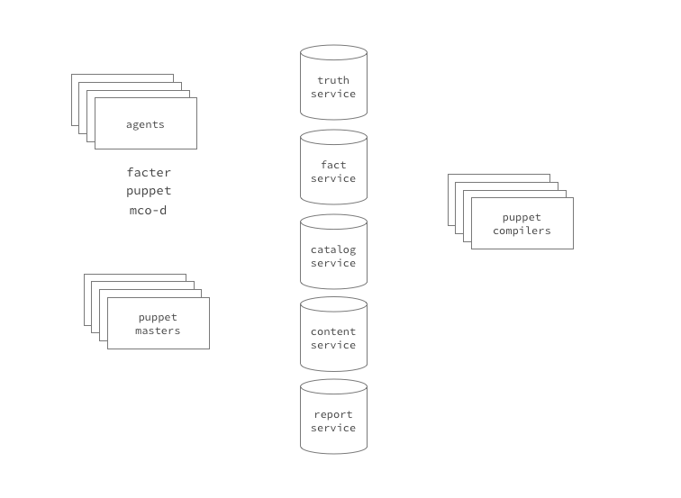

ARM-11: Puppet Execution Model
==============================

Summary
-------

This ARM describes an asynchronous execution model for Puppet and its
related components. It will likely end up as a "meta-ARM" which spans
a group of related changes, each of which is substantial enough to 
warrant its own ARM to dive into the details.

Goals
-----

The goals of moving to an asynchronous execution model are:

* Enable much easier scaling than is possible with a synchronous architecture.
* Move towards a componentized architecture that allows faster refactoring.
* Build a platform that enables sophisticated orchestration and sequencing.

Non-Goals
---------

This ARM does not intend to be prescriptive about wire-protocol-level
implementation details.

Success Metrics
---------------

Specific metrics are unclear at this time.

Motivation
----------

Puppet's client-server architecture right now has a problem at any significant 
scale.  Because catalog compilation is done on the master and is 
computationally expensive, and because clients can trigger a catalog 
compilation at will, cheaply, large sites find themselves in a constant 
struggle to avoid harming themselves with what amount to denial-of-service 
attacks from legitimate clients. An asynchronous architecture would allow 
catalog compilation to happen independent of client requests, so additional 
clients (or more frequent requests from the same population of clients) does 
not impose a linear load on the compiler hosts.

Thinking through the changes necessary to achieve this goal, it became clear 
that it would enable additional positive follow-on effects. In order to split 
out functionality that is currently combined into a monolithic puppet master 
process, the entaglements and incomplete separation-of-concerns between 
components of the codebase will need to be clearly defined, which enables 
quicker refactoring. And as a function of precompiling and storing catalogs, 
we enable sophisticated short time-scale orchestration across a population by 
'releasing' catalogs to selected subsets of nodes and triggering their 
execution on demand.

Description
-----------

### Execution Model Diagram

### On the node

I'm proposing the daemonized puppet agent would decouple fact submission from 
puppet agent execution. It would be responsible for:

* executing facter periodically and submitting facts to a new [Fact 
  Service](#description_fact_service) 
* checking for updated catalogs on the master, downloading and caching them 
  locally if there's a newer version than the previous cached catalog
* executing the puppet agent in one-shot mode on a schedule (optionally, 
  always in no-op mode)
* submitting reports (potentially as a continuous stream of events rather than 
  waiting until the end of the run to send everything) to a new [Report 
  Service](#description_report_service)

Additionally this model uses mcollectived on the node more centrally, because 
mcollective-triggered runs are essential for sequenced execution. Many sites 
are moving to an operational mode with puppet where every run is normally in 
no-op mode and only deployment windows have do-something mode set; mcollective 
would be responsible for triggering those runs.

### <a id="description_fact_service">Fact Service</a>

Currently, the puppet agent invokes facter at the beginning of each run, 
gathering facts in real-time and uploading them in the HTTP request for the 
node's catalog that it sends to the puppetmaster. In this model, the fact 
delivery and submission would be decoupled from the agent execution. Facter 
could then run on any appropriate schedule, which would probably be a much 
longer period than "every puppet run" because most facts do not change very 
quickly relative to the lifecycle of a node. 

The fact service consists of a queue of pending fact submissions and some 
workers which pull work off the queue and persist it to fact storage, which is 
exactly what PuppetDB does today when it's configured to [store facts in the 
inventory service](http://docs.puppetlabs.com/puppetdb/1.1/connect_puppet_master.html).  
The difference is that the fact submission is not tied to a catalog request by 
the client; instead the endpoint which receives the facts submission is 
responsible for detecting differences between the previous fact storage for 
that node and notifying the [Compiler Service](#description_compiler_service) 
that it needs to compile a new catalog using these facts.

### <a id="description_compiler_service">Compiler Service</a>
 
The Compiler Service is responsible for pulling compile requests of its own 
queue, compiling catalogs for nodes, and persisting them in catalog storage.  
Requests can come into the compiler queue from fact service, from a human 
interacting with a commandline, or any other event such as a post-commit hook 
which notifies the compiler service there is new code available that needs to 
get out to nodes.

The service persists compiled catalogs in Catalog Storage, which again already 
exists in PuppetDB. This area has perhaps the largest number of changes 
necessary from today's execution model:

* This needs to be a  
  [static-compiler-ish](http://projects.puppetlabs.com/issues/6873) kind of 
  catalog (sourced urls containing the checksum of the file inside the catalog) 
  so that changes in files result in a different catalog. Files that are 
  referenced by URL but whose contents are not stored in the catalog need to 
  get populated into a new [Content Service](#description_content_service).
* Similarly, the [config_version 
  variable](https://github.com/puppetlabs/puppet/blob/master/lib/puppet/defaults.rb#L334-L340), 
  or something functionally equivalent, needs to a reliable indicator of 
  whether _anything_ has changed in the components of the catalog; at the 
  moment only site.pp changing causes this value to change.
* Environments should live with real separation in this compiler service, which 
  probably means a Ruby interpreter per environment.
* It should be possible to pre-compile catalogs for a node but not serve them 
  up yet; this would fix the 'thundering herd' problem because as soon as code 
  was complete you could start compiling, but nodes would only know about the 
  changes when they were told to look for them.
* The PuppetDB wire format is a pure JSON implementation of the catalog format, 
  not the same thing as the agent consumes today. They should be unified, so 
  the translation step that happens now on the way out to PuppetDB from the 
  compiler is no longer necessary.

### <a id="description_content_service">Content Service</a>

TBD

Testing and Evaluation
----------------------

What kinds of test development and execution will be required in order
to validate this enhancement, beyond the usual mandatory unit tests?
Be sure to list any special platform or hardware requirements.

What criteria should people use to evaluate the alternatives? If
there are suggestions you have as the author for helping readers
decide between alternatives (or whether to the ARM should be 
implemented at all), build a decision tree here.

Alternatives and Recommendation
-------------------------------

Did you consider any alternative approaches or technologies?  If so
then please describe them here and explain why they were not chosen.

Describe which, if any, of the alternatives you recommend and why
you prefer it. This could walk through the Author's use of the
"Evaluation" decision tree explaining the rationale.

Risks and Assumptions
---------------------

Describe any risks or assumptions that must be considered along with
this proposal.  Could any plausible events derail this work, or even
render it unnecessary?  If you have mitigation plans for the known
risks then please describe them.

Dependencies
------------

Describe all dependencies that this ARM has on other ARMs, components,
products, or anything else.  Dependences upon other ARMs should also
be listed in the "depends:" field in the metadata.json.

Describe any ARMs that depend upon this ARM before they can be implemented.

Impact
------

How will this work impact other parts of the platform, the product,
and the contributors working on them?  Omit any irrelevant items.

- Other Puppet components: ...
- Compatibility: ...
- Security: ...
- Performance/scalability: ...
- User experience: ...
- I18n/L10n: ...
- Accessibility: ...
- Portability: ...
- Packaging/installation: ...
- Documentation: ...
- Spin-offs/Future work: ...
- Other: ...
